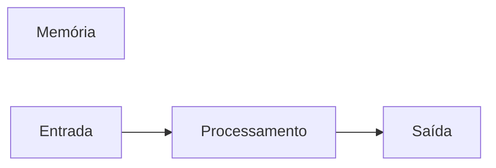

# Javascript-joseAssis
Repositório usado para estudo  da lógica de programação com JavaScript

## Autor
Rafael Tavares
---

## Variáveis
Variáveis são espaços na memória do computador usado para guardar valores que podem alterar ao longo do programa.
### Principais tipos primitivos:
- strings ( Texto )
- number ( números inteiros e não inteiros )
- boolean ( Verdadeiro ou falso )


## Operadores Aritméticos
| Operador | Propósito | Exemplo | Resulado |
|----------|-----------|---------|----------|
| = | Atribuir um valor | x = 10 | x = 10 |
| + | Somar | 10 + 5 | 15 |
| += | Somar e atribuir | x += 5 | x = 15 |
| - | Subtrair | 15 -10 | 5 |
| -= | Subtrair e atribuir | x -= 10 | x = 5 |
| * | Multiplicar | 5 * 10 | 20 |
| *= | Multiplicar e atribuir | x *= 4 | x = 20 |
| / | Dividir | 20 / 2 | 10 |
| /= | Divifir e atribuir | x /= 2 | 10 |
| ++ | Somar 1 ao resultado | x ++ | 11 |
| -- | Subtrair 1 do resultado | x -- | 9 |
| % | Resto da  divisão | 9 % 3 | 0 |


## Operadores Lógicos
| Operador | Simbologia |
|----------|-----------|
| AND | && |
| OR | \|\| |
| NOT | ! |


##  Comparadores
| Comparador | Significado | 
|----------|-----------|
| > | Maior que |
| >= | Maior ou igual a |
| < | Menor que |
| <= | Menor ou igual a |
| === | Idêntico a |
| !== | Não Idêntico a |

---

## Estruturas de controle

### Estruturas de controle condicionais

### Estrurua 1

```javascript

if (condição){
//condição verdadeira
}
```
### Estrurua 2

```javascript
if (condição){
//condição verdadeira
} else {
//condição falsa
}
```
### Calcular média

```javascript
// Importação de pacotes
const color = require('colors')
const prompt = require('prompt-sync')()

// Variaáveis
let nota1, nota2, media

console.clear()
console.log('Calculo da média')

// Entrada de dados
nota1 = Number(prompt('Digite a primeira nota: '))
nota2 = Number(prompt('Digite a segunda nota: '))

// Processamento
media = (nota1 + nota2) / 2

// Saída de dados
console.log(' ')

if (media < 5){
    console.log(`Sua média é ${media.toFixed(2)}, você está reprovado`.red)
} else {
    console.log(`Sua média é ${media.toFixed(2)}, você está aprovado`.green)
}

//else if

if (condição 1) {
    //condição 1 verdadeira
} else if (condição 2) {
    //condição 2 verdadeira
}  else {
    //se nenhuma das condições anteriores for verdadeira
}


switch (valor) {
    case 1:
      //código caso o valor seja 1
      break
    case 2:
      //código caso o valor seja 2
      break
    default:
      //código caso o calor seja diferente de 1 ou 2
      break
}
```


### Laços de repetições
```javascript
    for (let i = 1; i < 10; i++) {
    // o código é repetição enquanto a condição (i < 10) for verdadeira
}

    while (condição) {
    //o código é repetido enquanto a condição for verdadeira
}
    do {
    // o código é executado uma vez independente da condição, depois
    // o código é repetido enquanto a condição for verdadeira
}    while (condição)
```
